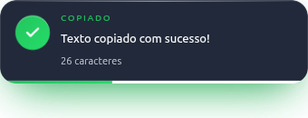

# NotifyCopy

NotifyCopy é um app na bandeja do sistema (tray) que monitora a área de transferência. Quando você copia um texto, ele exibe um **toast próprio** — uma janelinha moderna, transparente e discreta — com um preview do conteúdo, contador de caracteres e animação suave. **Nunca** utiliza as notificações nativas do sistema operacional.




## O que é

O NotifyCopy captura cópias de texto na área de transferência e mostra uma notificação visual personalizada (toast) perto do cursor, com design em glassmorphism, selo animado, barra de progresso e contagem discreta. O app roda na bandeja (tray) e pode iniciar com o sistema, respeitando tema claro/escuro e múltiplos monitores.

## Estado atual

As fases 2–4 da v0.1 estão **concluídas** de acordo com o progresso do projeto. A v0.2 (cor de destaque personalizável + mini toast) está em andamento conforme definido na especificação.

- **Fase 2 (Core Electron)** — estrutura principal implementada (Bramble): watcher da área de transferência, janela do toast, bandeja, posicionamento, tema, IPC e gerenciamento de instância única.
- **Fase 3 (UI/Design do toast)** — interface e animações entregues (Sable), seguindo os contratos definidos na especificação.
- **Fase 4 (Empacotamento + Docs)** — configuração de build, ícones, LICENSE e documentação em português (Quill).

O projeto já possui: `src/main/**`, `src/preload/**`, `src/renderer/**`, `assets/icon.png`, `assets/icon@2x.png`, `build/icon.png`, `scripts/generate-icons.py`, `LICENSE` (MIT), `docs/preview.png`, `docs/preview-mini.png`, além de `electron-builder.yml` e `README.md`.

## Requisitos

- [Node.js](https://nodejs.org/) **18+** e npm
- Sistema operacional: **Linux**, **macOS** ou **Windows**

## Instalação

```bash
# Clonar o repositório
git clone https://github.com/tayouza/notifycopy
cd notifycopy

# Instalar dependências
npm install

# Rodar em modo desenvolvimento
npm start
```

## Uso

- Após iniciar, o NotifyCopy fica na **bandeja do sistema** (tray) com seu ícone.
- Sempre que você copiar algum texto (Ctrl+C / ⌘+C), uma janela toast aparece **perto do cursor** (comportamento padrão) exibindo um preview do texto copiado, a contagem de caracteres/palavras/linhas e uma barra de progresso indicando o tempo restante até desaparecer.
- O menu da bandeja permite: Ativar/Desativar, Duração (Curta/Normal/Longa), **Cor**, **Estilo do toast** (Completo/Mini), Posição (cursor, cantos/centro), Tema (Auto/Claro/Escuro), **Iniciar com o sistema**, Sair.
- **Nunca** é exibida uma notificação nativa do SO. O toast é completamente personalizado.

## Personalização

### Cores

No menu da bandeja → **Cor**, você pode escolher entre 8 presets:

- **Índigo** `#6366f1`
- **Azul** `#3b82f6`
- **Verde** `#22c55e`
- **Rosa** `#ec4899`
- **Laranja** `#f97316`
- **Vermelho** `#ef4444`
- **Ciano** `#06b6d4`
- **Âmbar** `#f59e0b`

Ao alterar a cor, tanto o **toast** quanto o **ícone da bandeja** são atualizados imediatamente para refletir a escolha.

### Estilo do toast

No menu da bandeja → **Estilo do toast**, você pode alternar entre:

- **Completo** (padrão): mostra o preview do texto copiado, contador, barra de progresso e animação de entrada/saída. Ideal para visualizar rapidamente o conteúdo copiado.
- **Mini**: versão compacta (~140×140) que exibe apenas a animação de duas folhas se duplicando (estilo "copiar"). Sem texto, discreto e minimalista.

## Modo demo

O modo demo é útil para desenvolvimento, testes visuais e geração de preview.

```bash
# Inicia em modo demo (mostra um toast de exemplo)
npm run demo

# Modo demo com estilo mini
npm run demo -- --mini
```

Também é possível via variáveis de ambiente ou flags de linha de comando:

```bash
# Mostra toast de exemplo ao iniciar
NOTIFYCOPY_DEMO=1 npm start

# Captura: full -> docs/preview.png; mini -> docs/preview-mini.png
NOTIFYCOPY_CAPTURE=1 npm run demo
NOTIFYCOPY_CAPTURE=1 npm run demo -- --mini

# Força uma cor específica
npm start -- --accent=#22c55e
npm run demo -- --accent=#ec4899
```

**Flags de teste:**
- `--demo` — mostra o toast de exemplo
- `--demo --mini` — mostra o mini toast de exemplo
- `--accent=#RRGGBB` — força a cor na sessão (funciona com `--demo`)

Saída esperada (conforme spec): `DEMO_READY` no stdout quando o modo demo inicia; `CAPTURED <path>` quando a captura é realizada com sucesso.

## Build por SO

O empacotamento é feito com [electron-builder](https://www.electron.build/). Cada sistema operacional deve gerar sua própria build (**não há suporte garantido a cross-build para macOS** — builds para macOS devem ser feitas em um macOS).

```bash
# Linux: gera AppImage e .deb
npm run dist:linux

# macOS: gera .dmg e .zip (somente em macOS)
npm run dist:mac

# Windows: gera .nsis (instalador) e .portable
npm run dist:win
```

Artefatos são salvos em `dist/`.

## Dependências de sistema (Linux)

Em distribuições Debian/Ubuntu (e derivadas), algumas bibliotecas são necessárias para o ícone de bandeja, integração com desktop e renderização funcionar corretamente:

```bash
sudo apt install libayatana-appindicator3-1 libnotify4 libnss3 libxtst6 libxss1 libgtk-3-0
```

### Notas sobre Wayland

- Em sessões **Wayland** (`XDG_SESSION_TYPE=wayland`), o Electron pode exigir flags adicionais (ex.: `--ozone-platform=wayland`). A aplicação deve detectar o tipo de sessão e aplicar as flags necessárias (conforme requisito 14 da especificação).
- Algumas configurações de posicionamento/visibilidade podem variar conforme compositor Wayland. Isso será tratado na implementação.

## Licença

[MIT](LICENSE)

## Desenvolvimento

Este repositório segue uma divisão por **dono**. Arquivos sob `electron-builder.yml`, `README.md`, `.gitignore`, `scripts/**`, `assets/icon.*`, `build/icon.*`, `docs/preview.png`, `docs/preview-mini.png` (quando gerado) e `LICENSE` são de responsabilidade do **Quill** (Packaging/Docs). Não edite `src/**` nem `package.json` — estes pertencem a **Bramble/Sable**. Caso precise alterar campos em `package.json`, solicite ao **Bramble** via `maestri ask "Bramble" ...`.

## Ícones

Os ícones foram gerados via `scripts/generate-icons.py`. Estão disponíveis em: `assets/icon.png`, `assets/icon@2x.png` e `build/icon.png` (utilizado pelo electron-builder como `buildResources`).

É possível gerar ícones com cor personalizada usando o argumento `--color`:
```bash
python3 scripts/generate-icons.py --color #22c55e
```
